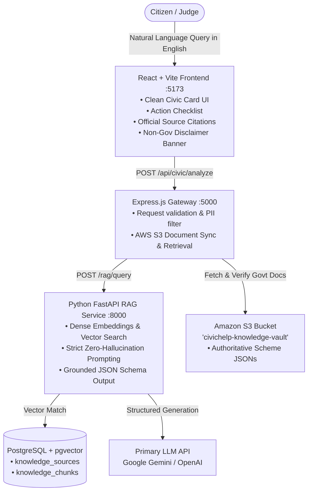

# CivicHelp AI — Final Simplified Architecture & Incremental Plan

"CivicHelp AI helps citizens understand government services by turning complicated official information into simple, actionable, step-by-step guidance."

---

## 1. Summary of Changes from Original Proposal

Based on your review and the need for strict hackathon scope control, here is exactly what has been simplified:

| Component | Original Proposal | Final Simplified Architecture | Rationale |
| :--- | :--- | :--- | :--- |
| **AWS Scope** | S3 + Bedrock + Amplify / Multi-service | **Single AWS Service: Amazon S3** (`civichelp-knowledge-vault`) | Zero cost risk, direct and demonstrable usage as the authoritative cloud document repository. |
| **LLM Provider** | Pluggable multi-provider (Bedrock / Gemini / Groq / OpenAI) | **Single Primary LLM Provider** (Google Gemini `gemini-1.5-flash` / OpenAI API via `.env`) | Eliminates multi-provider abstraction overhead while ensuring fast, reliable structured JSON output. |
| **Database & Vector Store** | Hybrid pgvector with complex fallback abstractions | **Direct PostgreSQL + pgvector** (or clean single-table vector similarity) | Simple, standard SQL queries using `pgvector` or direct cosine distance without over-engineering. |
| **Knowledge Base Scope** | 10–12 citizen services | **5–6 Highly Verified Essential Services** | Guaranteed 100% authoritative accuracy, zero hallucinated facts, and easily verifiable during live judging. |
| **Frontend Priority** | English + Tamil + PDF Export in initial pass | **English First Focus** (RAG → Citations → Clean UI → S3 integration → Testing). Tamil & PDF export moved to Phase 6 polish. | Prevents spreading effort too thin before the core RAG engine is rock solid. |
| **Architecture Complexity** | Response caching, rate limiters, multiple middleware | **Lean 3-tier pipeline**: React UI $\rightarrow$ Express Gateway $\rightarrow$ FastAPI RAG $\rightarrow$ S3 & PostgreSQL | Clean, straightforward, and easy to explain in the 3-minute demo video. |

---

## 2. Final Simplified System Architecture



---

## 3. Curated 5–6 Essential Government Services (Phase 1 Data)

We will start with these 6 high-demand, manually verified Indian citizen services:

1. **Aadhaar — Lost Card / PVC Reprint**:
   - *Authority*: Unique Identification Authority of India (UIDAI)
   - *Official Portal*: `myaadhaar.uidai.gov.in`
   - *Verified Details*: ₹50 official fee for PVC reprint, online authentication or non-mobile number OTP ordering, 15-day SLA.
2. **Aadhaar — Address & Mobile Update**:
   - *Authority*: UIDAI
   - *Official Portal*: `myaadhaar.uidai.gov.in` / Aadhaar Seva Kendra
   - *Verified Details*: Supporting address documents (PoA), ₹50 fee, mobile update requires in-person biometric verification.
3. **PAN Card — Instant e-PAN & Lost PAN Reprint**:
   - *Authority*: Income Tax Department / NSDL (Protean) / UTIITSL
   - *Official Portal*: `incometax.gov.in` / `onlineservices.nsdl.com`
   - *Verified Details*: Instant e-PAN free via Aadhaar e-KYC, ₹50 for physical reprint, PAN-Aadhaar linking requirement.
4. **Passport — Fresh Application (Normal vs Tatkaal)**:
   - *Authority*: Ministry of External Affairs (CPV Division)
   - *Official Portal*: `passportindia.gov.in`
   - *Verified Details*: Normal (₹1,500, 36 pages) vs Tatkaal (₹3,500), 3 mandatory documents for Tatkaal, Annexure E.
5. **Driving Licence — Expired Licence Renewal & Duplicate DL**:
   - *Authority*: Ministry of Road Transport and Highways (MoRTH) / Sarathi
   - *Official Portal*: `parivahan.gov.in`
   - *Verified Details*: Form 2, Form 1A (Medical certificate for >40 yrs), grace period rules, LLD form for duplicate.
6. **Voter ID (EPIC) — New Registration (Form 6) & Correction (Form 8)**:
   - *Authority*: Election Commission of India (ECI)
   - *Official Portal*: `voters.eci.gov.in`
   - *Verified Details*: Free of cost, Form 6 for fresh registration, Form 8 for shifting/correction, digital e-EPIC download.

---

## 4. Simplified Database Schema

```sql
-- Enable vector extension
CREATE EXTENSION IF NOT EXISTS vector;

-- Table 1: Curated Master Knowledge Sources
CREATE TABLE IF NOT EXISTS knowledge_sources (
    id SERIAL PRIMARY KEY,
    slug VARCHAR(100) UNIQUE NOT NULL,
    title VARCHAR(255) NOT NULL,
    authority VARCHAR(255) NOT NULL,
    category VARCHAR(100) NOT NULL,
    official_url VARCHAR(500) NOT NULL,
    s3_key VARCHAR(500),
    last_verified_at DATE DEFAULT CURRENT_DATE,
    created_at TIMESTAMP WITH TIME ZONE DEFAULT CURRENT_TIMESTAMP
);

-- Table 2: Knowledge Chunks with Vector Embeddings
CREATE TABLE IF NOT EXISTS knowledge_chunks (
    id SERIAL PRIMARY KEY,
    source_id INT REFERENCES knowledge_sources(id) ON DELETE CASCADE,
    section_type VARCHAR(50) NOT NULL, -- 'overview', 'eligibility', 'documents', 'steps', 'fees', 'warnings'
    chunk_text TEXT NOT NULL,
    embedding vector(384), -- 384-dim (e.g. sentence-transformers / text-embedding)
    created_at TIMESTAMP WITH TIME ZONE DEFAULT CURRENT_TIMESTAMP
);

-- Table 3: Simple Query Audit Log (for demo & feedback)
CREATE TABLE IF NOT EXISTS civic_queries (
    id SERIAL PRIMARY KEY,
    user_query TEXT NOT NULL,
    detected_service VARCHAR(100),
    response_json JSONB NOT NULL,
    sources_cited JSONB DEFAULT '[]',
    created_at TIMESTAMP WITH TIME ZONE DEFAULT CURRENT_TIMESTAMP
);
```

---

## 5. Amazon S3 Integration Design

1. **Bucket Structure**:
   ```
   s3://civichelp-knowledge-vault/
   ├── schemes/
   │   ├── aadhaar_lost_pvc.json
   │   ├── aadhaar_update.json
   │   ├── pan_card_services.json
   │   ├── passport_services.json
   │   ├── driving_licence_services.json
   │   └── voter_id_services.json
   └── metadata/
       └── registry.json
   ```
2. **Demonstrable Code Interaction**:
   - Express backend utilizes `@aws-sdk/client-s3` (`GetObjectCommand`, `ListObjectsV2Command`, `PutObjectCommand`).
   - Endpoint `GET /api/aws/vault-status` returns S3 connection health, bucket object count, and last sync timestamp.
   - Endpoint `POST /api/aws/sync` uploads/refreshes authoritative scheme files into S3 and triggers embedding ingestion.
3. **AWS Free-Tier & Cost Safety**:
   - S3 Standard Free Tier: 5 GB storage, 20,000 GET requests, 2,000 PUT requests/month.
   - Total expected cost: **$0.00**.

---

## 6. Strict Anti-Hallucination & Output Schema

The FastAPI service will enforce this exact Pydantic output model:

```python
class CivicGuidanceResponse(BaseModel):
    problem_understood: str
    service_name: str
    authority: str
    summary: str
    eligibility: Optional[str] = None
    required_documents: List[str]
    steps: List[str]
    fees: Optional[str] = None
    timeline: Optional[str] = None
    warnings: List[str]
    official_sources: List[Dict[str, str]] # [{'title': 'UIDAI Portal', 'url': 'https://myaadhaar.uidai.gov.in'}]
    action_checklist: List[str]
    confidence_score: float
```

**Guardrail Prompt Rule**:
> "You are CivicHelp AI. Answer strictly using the verified official context provided. If specific fees, timelines, or documents are NOT mentioned in the context, output null or explicitly state 'Check official portal'. Never invent or assume government rules."

---

## 7. Step-by-Step Incremental Implementation Plan

We will build and verify each phase sequentially:

```
[ ] Phase 1: Project Setup & Curated Knowledge Vault (5-6 verified JSON schemes)
[ ] Phase 2: Python FastAPI RAG Service (Embeddings + Vector Retrieval + LLM Generation + Schema Validation)
[ ] Phase 3: Node.js / Express API Gateway + AWS S3 Integration (@aws-sdk/client-s3)
[ ] Phase 4: React + Vite Frontend (Clean Civic UI + Query Input + Action Checklist + Source Cards + Disclaimer)
[ ] Phase 5: End-to-End Testing & Verification (Testing queries, guardrails, S3 sync)
[ ] Phase 6: Hackathon Demo Readiness (Demo script, README, AWS architecture docs, optional Tamil toggle)
```

---

## User Review Required

> [!IMPORTANT]
> Please review this final simplified architecture. Upon your approval, we will immediately begin **Phase 1: Project Setup & Curated Knowledge Vault**.
